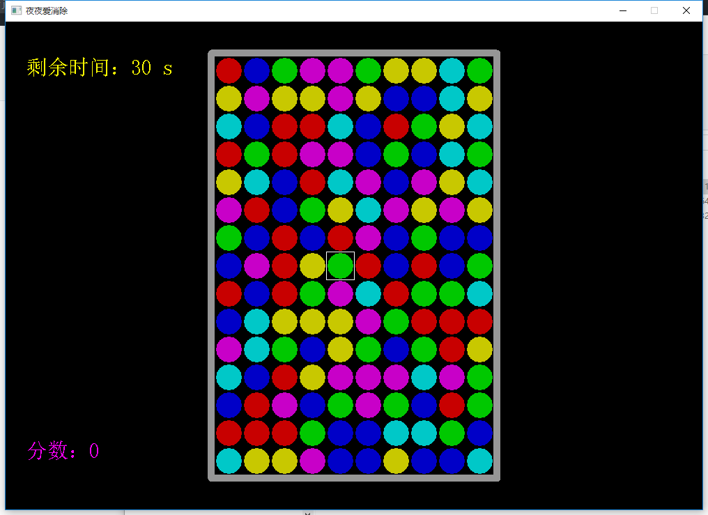
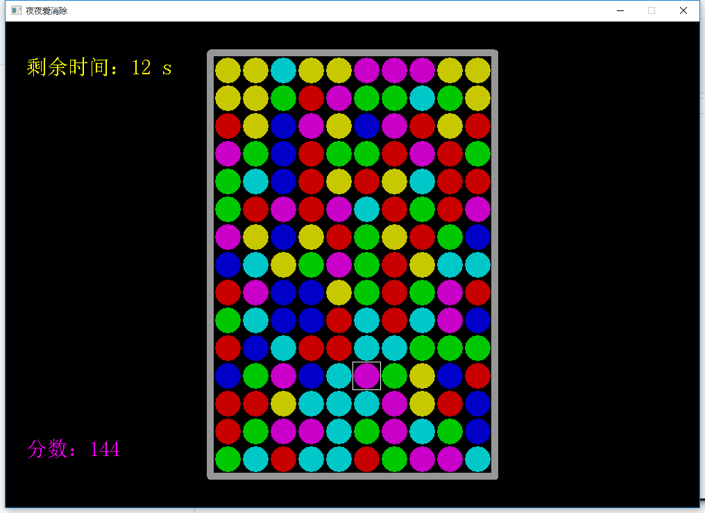
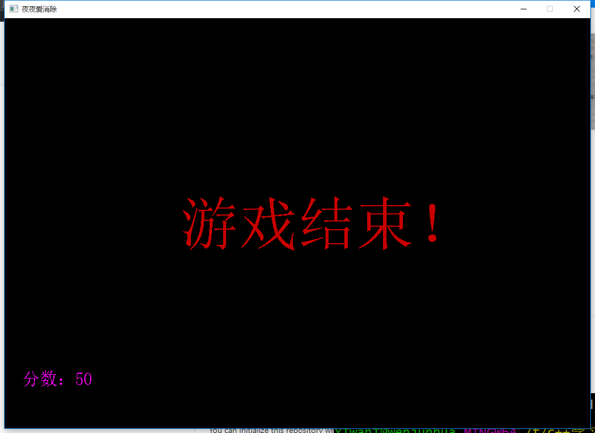

# 夜夜爱消除

## 简介

- 这个项目是跟着香蕉地老张头的视频学习的
- 使用easyX图形库

## 游戏效果

## 不足

- 按键控制有bug
- 小球下落的时候颜色没对

## 总结

- 第一次跟着写一个小游戏，学到了很多游戏方面的常识（如游戏中常使用的障眼法）
- 使用结构体来表示一个点的坐标非常方便，以前一直忽略结构体的使用
- 对easyX图形库的使用有了初步的了解，学会了查找文档，调用函数